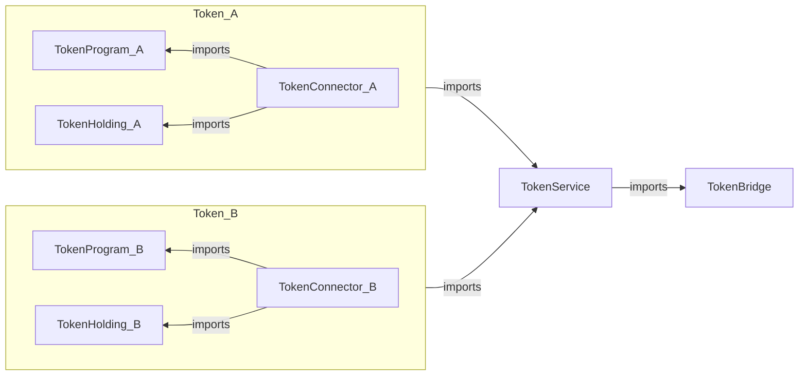

# Architecture Overview
This document provides overview of the implementation of Aleo programs for Aleo-Eth Multisig bridge. The overall architecture is discussed [here](../docs/architecture_overview.md).

There are five main programs on Aleo that make up the bridge.
1. Token Bridge
2. Token Service
3. Token Program
4. Token Holding 
5. Token Connector

## Program Dependencies

The dependencies between these program has been been described in the following graph:

## Common Data Structures

### Address
For address of Aleo, we represent with the primitive [`address`](https://developer.aleo.org/leo/language#addresses) type.
To represent addresses of some other chain, we represent it as bytes32 (zero-left-padded).
For EVM addresses (of 20 bytes), the first 12 bytes are 0s.
> Representing as bytes32 allows to add support for other chains in the future with the same programs.

Example: 
USDC Contract Address: 0xa0b86991c6218b36c1d19d4a2e9eb0ce3606eb48 is represented as following
[ 0, 0, 0, 0, 0, 0, 0, 0, 0, 0,  0, 0, 160, 184, 105, 145, 198, 33, 139, 54, 193, 209, 157, 74, 46, 158, 176, 206, 54, 6, 235, 72 ]

## Token Bridge
`Packet` is published, received (or attested) and consumed in the token bridge. When attestors find a packet on some other chain, they call `attest` on this chain with the entire `Packet` as argument.
Supported services such as `Token Service` program can then consume these packets to mint corresponding tokens. Similarly, supported services can `publish` messages that will be transferred to the destination chain.

It has the following functions:

## Token Service
Token Service validates the incoming messages and passes it to the Token Bridge to `publish` or `consume`.

## Token Program
This is the [ARC20 token](https://github.com/AleoHQ/ARCs/discussions/42) that represents bridged tokens on Aleo

## Token Holding
This program is responsible for holding disputed funds and transfers.

## Token Connector
This program acts as a connector between `Token Service` and `Token Holding` & `Token Program`. Since, Aleo has no support for interfaces yet, the connector is used.