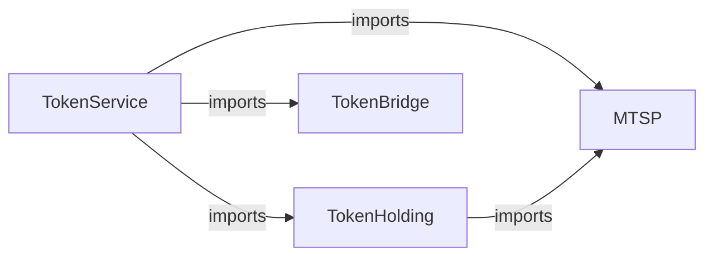

# Architecture Overview

This document provides overview of the implementation of Aleo programs for Aleo-Eth Multisig bridge. The overall architecture is discussed [here](../docs/architecture_overview.md).

There are four main programs on Aleo that make up the bridge on Aleo.

1. Token Bridge
2. Token Service
3. MTSP (Multi Token Support Program)
4. Token Holding

## Program Dependencies

The dependencies between these program has been been described in the following graph:



## Common Data Structures

### Address

For address of Aleo, we represent with the primitive [`address`](https://developer.aleo.org/leo/language#addresses) type.
To represent addresses of some other chain, we represent it as bytes32 (zero-left-padded).
For EVM addresses (of 20 bytes), the first 12 bytes are 0s.

> Representing as bytes32 allows to add support for other chains in the future with the same programs.

Example:
USDC Contract Address: 0xa0b86991c6218b36c1d19d4a2e9eb0ce3606eb48 is represented as following\
`[ 0, 0, 0, 0, 0, 0, 0, 0, 0, 0, 0, 0, 160, 184, 105, 145, 198, 33, 139, 54, 193, 209, 157, 74, 46, 158, 176, 206, 54, 6, 235, 72 ]`

### String

Since the string type is not supported on Aleo (yet), we represent string as ASCII-byte in hex, then concatenate all and convert to decimal again which will be stored as u128.\
Example: `USD Coin` is represented as following:\
String to ASCII-byte hex conversion: `55 53 44 20 43 6F 69 6E`\
Concatenate together: `55534420436F696E`\
Convert to Decimal: `6148332821651876206`\
`6148332821651876206` will be stored as `u128` for the `name` field.

## Token Bridge

[`Packet`](../docs/architecture_overview.md#packet) is published, received and consumed in the token bridge. When attestors find a packet on some other chain, they sign the `Packet` and publishes the signature on the database. The users can then collect those signatures from the database and can directly consume those packets to mint corresponding assets via supported services such as `Token Service` program.
Similarly, supported services can `publish` messages that will be transferred to the destination chain. It has the following functions:

## Token Service

Token Service validates the incoming messages and passes it to the Token Bridge to `publish` or `consume`. Also since Token Service imports MTSP, token service has to fulfill function of adding and registering new tokens in the MTSP without needing to deploy separate program for Tokens. This makes it redundant to deploy new programs for token which doesn't have any special functionality.

## Token Holding

This program is responsible for holding disputed funds and transfers for every token that is being received through the bridge.

## Ownership and Upgradeability

Each of the above program has a owner that performs admin functions. The owner can be set during initialization and the ownership can be transferred only from the current owner.

| Programs      | Owner         |
| ------------- | ------------- |
| Token Bridge  | Council       |
| Token Service | Council       |
| Token Holding | Token Service |
| MTSP          | Token Service |

### Council Program

Council is a separate program that acts as a multisig to perform admin functions. Functions from council can be executed only if threshold of members (of council) vote to perform a particular action.

Since our architecture features a single token bridge, token holding and token service program, the council imports these programs. Where council is responsible for executing different function that require voting from council members. For example to release fund from holding contract, council needs to propose release proposal with enough votes to pass the threshold, and calls release funtion in holding contract which will release assets to the actual receiver.

# Testing

We conduct testing using [DokoJS](<](https://github.com/venture23-aleo/doko-js/)>). Tests are scripted in TypeScript and can be found in the [`test`](./test) directory. To execute the tests successfully, you'll need to have DokoJS installed, along with the snarkos node running on the default port (3030).

## Setup

Before running the tests, ensure you have the following prerequisites in place:

**1. Rust:** Refer to the [Installation Guide](https://www.rust-lang.org/tools/install) for assistance with Rust installation. `Used v1.76.0`

**2. SnarkOS:** Clone the testnet3 branch of snarkOS. Use following clone script instead of default clone script provided in snarkos readme.

```bash
git clone --branch testnet3 https://github.com/AleoHQ/snarkOS.git --depth 1
```

Follow the instructions afterwards cloning provided in the [Installation Guide](https://github.com/AleoHQ/snarkos?tab=readme-ov-file#22-installation). If you encounter build issues, consider trying the fix provided [here](https://github.com/eqlabs/snarkOS/tree/fix/compile). `Used v2.2.7`

**3. Leo language:** Get Leo up and running with the help of the [Installation Guide](https://github.com/aleoHQ/leo).

**4. DokoJS:** Installing DokoJS. You can install DokoJS using npm or from source. `Used v0.0.2`

##### From NPM

Install DokoJS globally using npm:
`npm install -g @doko-js/cli@latest`

##### From Source

```bash
# Download the source file
git clone https://github.com/venture23-aleo/doko-js.git

cd doko-js

# Install the dependencies
pnpm install

# Build the project
npm run build

# Install dokojs
npm run install:cli
```

## Running Tests

1. Clone the repository.

```bash
git clone https://github.com/venture23-aleo/aleo-bridge.git

cd aleo-bridge

# Change branch to update/readme-update-dokojs, after PR is merged git checkout develop
git checkout update/readme-update-dokojs
```

2. Install the dependencies and create env file.

```bash
cd aleo

# Install the dependencies
npm install

# Create .env file. 4 private keys on the .env.example are the default private keys on the local devnet with aleo credits.
cp .env.example .env
```

3. Compile the programs using the following command:

```bash
dokojs compile
```

3. Just run following on the snarkOS directory where you cloned and build snarkOS. Start the snarkos devnet. More instructions about running devnet can be found [here](https://github.com/aleoHQ/snarkos?tab=readme-ov-file#63-local-devnet).

```bash
# Settings: 4 validators, clients 0
./devnet.sh
```

5. Run the tests for a specific program `(filename example: 1_tokenBridge.test.ts)` using the following command:

```bash
npm run test --runInBand --  1_tokenBridge
```

Test are formatted such that first describe block consists of tests that are to be run in execute mode with devnet locally running which requires transition and finalize block both to be run, and second describe block consists of tests that are to be run in evaluate mode and will only check the transition function logic running and it doesn't require devnet to be running.

So, if you want to run only execute mode test or evaluate mode test then modify the required test files with `describe.skip` for the block which you want to skip.
