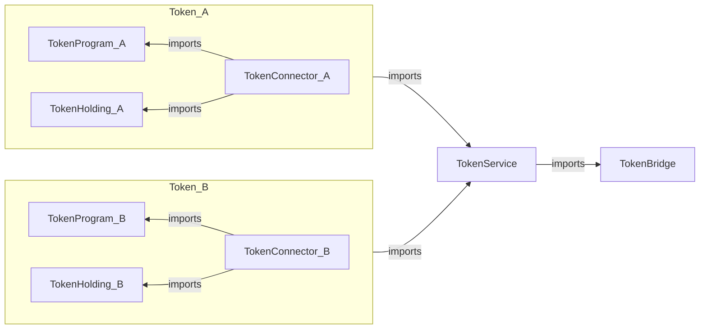

# Architecture Overview

This document provides overview of the implementation of Aleo programs for Aleo-Eth Multisig bridge. The overall architecture is discussed [here](../docs/architecture_overview.md).

There are five main programs on Aleo that make up the bridge on Aleo.

1. Token Bridge
2. Token Service
3. Token Program
4. Token Holding
5. Token Connector

## Program Dependencies

The dependencies between these program has been been described in the following graph:



## Common Data Structures

### Address

For address of Aleo, we represent with the primitive [`address`](https://developer.aleo.org/leo/language#addresses) type.
To represent addresses of some other chain, we represent it as bytes32 (zero-left-padded).
For EVM addresses (of 20 bytes), the first 12 bytes are 0s.

> Representing as bytes32 allows to add support for other chains in the future with the same programs.

Example:
USDC Contract Address: 0xa0b86991c6218b36c1d19d4a2e9eb0ce3606eb48 is represented as following
[ 0, 0, 0, 0, 0, 0, 0, 0, 0, 0, 0, 0, 160, 184, 105, 145, 198, 33, 139, 54, 193, 209, 157, 74, 46, 158, 176, 206, 54, 6, 235, 72 ]

### String

Since the string type is not supported on Aleo (yet), we represent string as ASCII-byte (zero-right-padded).
Example: `USD Coin` is represented as following:
[85, 83, 68, 32, 67, 111, 105, 110, 0, 0, 0, 0, 0, 0, 0, 0, 0, 0, 0, 0, 0, 0, 0, 0, 0, 0, 0, 0, 0, 0, 0]

## Token Bridge

[`Packet`](../docs/architecture_overview.md#packet) is published, received and consumed in the token bridge. When attestors find a packet on some other chain, they sign the `Packet` and publishes the signature on the database. The users can then collect those signatures from the database and can directly consume those packets to mint corresponding assets via supported services such as `Token Service` program.
Similarly, supported services can `publish` messages that will be transferred to the destination chain. It has the following functions:

## Token Service

Token Service validates the incoming messages and passes it to the Token Bridge to `publish` or `consume`.

## Token Program

This is the [ARC20 token](https://github.com/AleoHQ/ARCs/discussions/42) that represents bridged tokens on Aleo.

## Token Holding

This program is responsible for holding disputed funds and transfers.

## Token Connector

This program acts as a connector between `Token Service` and `Token Holding` & `Token Program`. Since, Aleo has no support for interfaces yet, the connector is used.

## Ownership and Upgradeability

Each of the above program has a owner that performs admin functions. The owner can be set during initialization and the ownership can be transferred only from the current owner.

| Programs        | Owner           |
| --------------- | --------------- |
| Token Bridge    | Council         |
| Token Service   | Council         |
| Token Program   | Token Connector |
| Token Holding   | Token Connector |
| Token Connector | Council         |

### Council Program

Council is a separate program that acts as a multisig to perform admin functions. Functions from council can be executed only if threshold of members (of council) vote to perform a particular action.

Since our architecture features a single token bridge and token service program, the council imports these programs. However, as each token is deployed separately (as ARC20 token) and new tokens can be added over time, the token connector imports the council instead. If we move from a council program to a general multisig, there is no need to update the token bridge and token service but the for each token, new connector program needs to be deployed.

# Testing

We conduct testing using [DokoJS](<](https://github.com/venture23-aleo/doko-js/)>). Tests are scripted in TypeScript and can be found in the [`test`](./test) directory. To execute the tests successfully, you'll need to have DokoJS installed, along with the snarkos node running on the default port (3030).

## Setup

Before running the tests, ensure you have the following prerequisites in place:

**1. Rust:** Refer to the [Installation Guide](https://www.rust-lang.org/tools/install) for assistance with Rust installation.

**2. SnarkOS:** Follow the instructions provided in the [Installation Guide](https://github.com/AleoHQ/snarkos?tab=readme-ov-file#22-installation). If you encounter build issues, consider trying the fix provided [here](https://github.com/eqlabs/snarkOS/tree/fix/compile).

**3. Leo language:** Get Leo up and running with the help of the [Installation Guide](https://github.com/aleoHQ/leo).

#### Installing DokoJS

##### From NPM

Install Aleo.js globally using npm:
`npm install -g @doko-js/cli@latest`

##### From Source

```bash
# Download the source file
git clone https://github.com/venture23-aleo/doko-js

cd doko-js

# Install the dependencies
pnpm install

# Build the project
npm run build

# Install dokojs
npm run install:cli
```

## Running Tests

1. Install the dependencies.

```bash
npm install
```

2. Compile the programs using the following command:

```bash
dokojs compile
```

3. Start the snarkos devnet. More instructions about running devnet can be found [here](https://github.com/aleoHQ/snarkos?tab=readme-ov-file#63-local-devnet)

```bash
./devnet.sh
```

4. Run the tests for a specific program (example: tokenBridge) using the following command:

```bash
npm run test --runInBand --  1_tokenBridge
```
