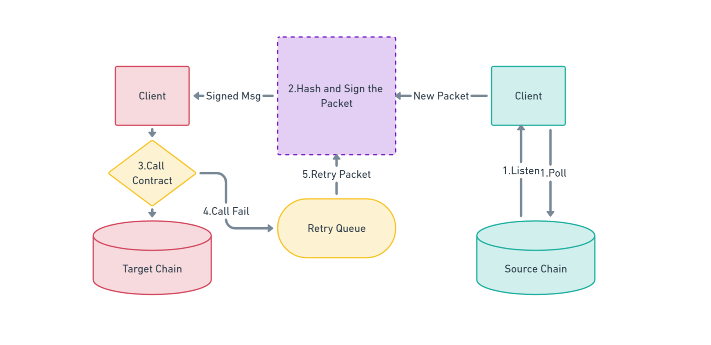
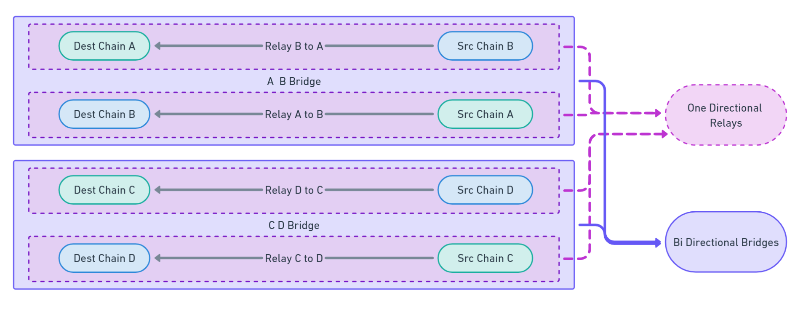
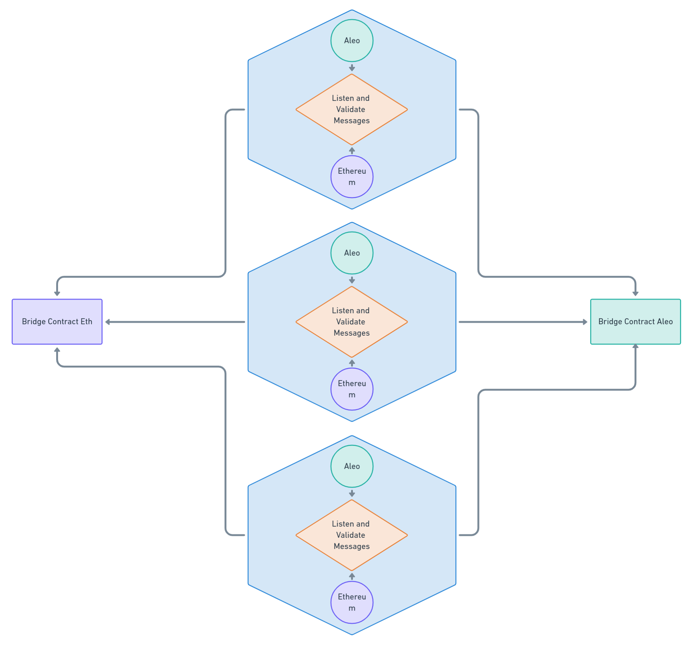

# Table of Contents

1. [Architecture Overview](#architecture-overview)
   - [Introduction](#introduction)
   - [Assumptions](#assumptions)
   - [Common Data Structures](#common-data-structures)
   - [Logical Components](#logical-components)
2. [Common Data Structures](#common-data-structures)
   - [NetworkAddress](#networkaddress)
   - [TokenMessage](#token-message)
   - [Packet](#packet)
3. [Logical Components](#logical-components)
   - [Common Contracts](#common-contracts)
     - [Bridge Contract](#bridge-contract)
     - [Token Service Contract](#token-service-contract)
       - [Token Contract Storage Structure](#token-contract-storage-structure)
       - [Token Service Contract Interface](#token-service-contract-interface)
     - [Holding Contract](#holding-contract)
    - [Additional Components](#additional-components)
        - [Token Contract on Aleo)](#token-contract-on-aleo)
        - [Multisig Contract on Aleo)](#multisig-contract-on-aleo)
        - [Ethereum Multisig](#ethereum-multisig)
   - [Attestor](#attestor)
     - [Workflow Steps](#workflow-steps)
     - [Data Structures](#data-structures)
     - [Components Overview](#components-overview)
     - [Reference For Implementation](#reference-for-implementation)
         - [Chain Config Interface](#chain-config-interface)
            - [Message Interface](#message-interface)
            - [Store Interface](#store-interface)
            - [Client Interface](#client-interface)
            - [Chain Interface](#chain-interface)
            - [Receiver Interface](#receiver-interface)
            - [Sender Interface](#sender-interface)
            - [Relayer Interface](#relayer-interface)
            - [Bridge Interface](#bridge-interface)
4. [ Key Management](#key-management)
5. [Fee Management](#fee-management)
6. [System Error And Recovery](#system-error-and-recovery)
7. [Safeguarding Against Disasters](#safeguarding-against-disaster)
5. [Glossary](#glossary)

# Architecture Overview

This document provides detailed requirements and design guidelines for the smart contracts required for the Aleo-Eth Multisig bridge. This will make sure that we have a general consensus on workflow of the bridge and also keep the spec uniform over multiple languages or platforms. There might be platform specific deviations in implementation details but it is expected the overall architecture will remain consistent on every platform.


## Introduction

This is a trusted  bridge platform that is designed to help move assets between Ethereum and Aleo blockchain.

## Assumptions
The design of the platform relies on following assumptions to be correct.

### Trustable Participants
It is assumed that the parties that will be running the attestor for the bridge can be trusted because of their self-interest and reputation. It is assumed the majority of participants (3 out of 5) wont collude to attack the bridge.

## Common Data Structures
All components of bridge agree to some common data structures which are as follows:

### NetworkAddress
It is the data structure that should allow us to point to any resource in any network uniquely.
Can also be represented as single string url as : `{chain_id}/{address}`.
```rust
pub struct NetworkAddress {
    pub chain_id: u128,
    pub address:  String,
}
```

| Name             | Remarks                                                                           |
|------------------|-----------------------------------------------------------------------------------|
| ChainId |  Uniquely assigned number for a chain to identify them in the network. |
| Address | Address of contract or package name that resides on the chain specified by chain id  |

### Token Message
It is the message created by a token contract to transfer or withdraw assets.
```rust
pub struct TokenMessage {
    pub sender_address:     String,
    pub dest_token_address: String,
    pub amount:             u128,
    pub receiver_address:   String,
}

```

| Name             | Remarks                                                                           |
|------------------|-----------------------------------------------------------------------------------|
| Sender Address   | Address of the sender on the source chain.                                        |
| Destination Token Address            | The field represents the address of token we are dealing with in target chain.|
| Amount           | The amount of fungibles to be transferred.                                        |
| Receiver Address | Address of the receiver on the target chain.                                      |


### Packet
It consists of all the information that is required for the components in our bridge to process the message, verify it and execute it.

```rust
pub struct Packet{
    version:     u8,
    destination: NetworkAddress,
    source:      NetworkAddress,
    sequence:    u64,
    message:     TokenMessage,
    height:      u64,
}

```

| Name        | Remarks                                                                             |
|-------------|-------------------------------------------------------------------------------------|
| Version     | Packet versioning for future enhancements or changes.                               |
| Destination | Target chain’s chain_id and (token) service contract address                        |
| Source      | Source chain's chain_id and (token) service contact address                         |
| Sequence    | sequence no of the packet for the target chain.                                  |
| Message     | [TokenMessage](#token-message)                                                      |
| Height      | Height of the source chain where the packet was created                             |

## Logical Components
Key logical components in the platform and their interfaces are describe below in detail.

### Main Contracts
Each participating chain will have at least two contracts i.e. Bridge Contract and TokenService Contract. 
There may be more contracts depending on the platform requirements.

#### Bridge Contract
Bridge contract is responsible for sending and receiving messages and does not concern with the contents of the message.
It will make sure that the message is accessible only to the contract that the message was addressed to.
For detailed design and interface we can follow below link:
[BridgeContract Design And Interface](bridge_contract.md)

#### Token Service Contract
This contract is responsible for interacting with other ERC20-like tokens to mint/burn (on Aleo) or lock/unlock (on Ethereum) and pass relevant information to bridge contract as TokenMessage.

##### Token Service Contract Storage Structure

| Name      | Structure      | Remarks                                       |
|-----------|----------------|-----------------------------------------------|
| TVL       | token_id=>u128 | Total Volume Locked On Contract               |
| Blacklist | address=>bool  | List of black listed address on current chain |
| Supported Tokens | token_id=>bool  | List of tokens recognized by the contract and status of the token (enabled/disabled) |
| Token Service Contracts | chain_id=>address | Address of the corresponding token service contracts of the given chain_id |

##### Token Service Contract Interface
```rust 
pub trait TokenServiceContract{
    pub fn transfer(&self,recipient:String, token:String, amount: u64, to_chain_id: u32);
    pub fn withdraw(&self, packet:Packet, sigs: []);
    pub fn validate_blacklisted(address:String)->bool;

    pub fn is_supported_token(address:String)->bool;
    pub fn is_enabled_token(address:String)->bool;

    pub fn add_chain(chain_id: u32, token_service_address: String);

    // TODO: add details
    pub fn add_token(address: String, token: TokenInfo);
    pub fn remove_token(address: String);

    pub fn enable_token(address: String);
    pub fn disable_token(address: String);

    pub fn add_to_blacklist(address: String);
    pub fn remove_from_blacklist(address: String);
}
```
**Transfer:** This method will be invoked by the frontend/user to transfer assets from one chain to another. User will provide the target chain_id, recipient address of the target chain, asset in the current chain and the amount that needs to be transferred. For verified request token service contract will construct TokenMessage and call send_message on bridge contract with the token service contract of target chain as destination. Token contract will also update the TVL data.

**Withdraw:** This method can be invoked on the target chain once the user has called transfer on the source chain. 
Users will need to provide the [Packet](#packet) information along with enough signatures from valid attestors to unlock/withdraw the asset. 

Bridge contract asserts that signatures are valid and the packet has not been consumed previously. Token service contract can proceed to mint/unlock the asset and update the TVL as well. The function can be called by anyone to transfer value to recipient but in case of value transferred being higher than threshold amount only council would be able to complete the transaction.

**Validate Blacklist:** Frontend can query on eth side to check if address is already on our blacklist or not.

**Enable Token:** This will either create a new entry on supported token or enable it if it is disabled. Called by governance.

**Disable Token:** This will temporarily disable moving of the token specified in case of a disaster. Called by governance.

**Add To Blacklist:** Add an address of a malicious user in blacklist to prevent it from utilizing the token service. Called by governance.

**Remove Blacklist:** Remove a user from blacklist. Called by governance.

#### Holding Contract
This contract is responsible for holding disputed funds and transfers. In event of transfer being initiated to an address that is blacklisted on target chain, the token service contract on target chain will lock the funds in holding contract. The funds can be released by council multisig once the dispute has been settled for the blacklisted address.
[Contract Design And Interface](holding_contract.md)

### Additional Components
Apart from above three contracts there might be additional contracts depending on the platform.These contracts are covered here.

##### Token Contract on Aleo
The Wrapped Token Contract is responsible for managing the minting, burning, and transfer of all wrapped assets. Each wrapped token will be deployed as a separate program on Aleo. The wrapped token will follow the [ARC20 proposal](https://github.com/AleoHQ/ARCs/discussions/42) to be compatible with the larger ecosystem.

##### MultiSig Contract on Aleo
To be based on Puzzle's multisig.

##### Ethereum Multisig
Gnosis Safe Multisig will be maintained using council keys which will also follow majority threshold. 
The multisig will be used to deploy contracts, upgrade contracts and update contract configurations/blacklists.

### DB Service
DB service is the publicly read-accessible database where only the attestors are allowed to have write-access in certain format. Attestor will pick up the packet from the bridge contract, analyzes/validates it and send the signature to this database. Users shall collect signatures from this database and send it to the target contract where upon threshold requirement met, user's funds shall be unlocked/minted in the target smart-contract.

It is the db-service that helps bypass transactional cost that atttestors had to bear otherwise.

### Attestor
Attestor is the bridge component that will be responsible for detecting new messages, validating addresses in them through chain-analysis and broadcasting signature to the common database service. Users can collect and send them to the target network by calling the target bridge contract.

Note that Attestors will pick up the packet only after certain duration after it is created so that chain-analysis have enough time to capture addresses in the packet in it's radar. As of now we have considered this duration to be 24 hours.

 Each attestor entity will be running their own full node of the involved chains and listen for incoming messages. Attestors do not have knowledge of other attestors in the network and are concerned only with verifying messages it has seen in the network. It will follow the following steps to make sure that the messages are delivered infallibly.



#### Workflow Steps
 - Listen/Poll for new packets from source chain contract.
 - On arrival of a new packet, compute its packet hash and sign it to create a signature.
- Call the target bridge contract with the packet and the signature.
- If the call is successful and the packet is in the finalized block the delivery is considered complete else stash the packet in the retry queue.
 - Periodically check the retry queue and try to resend if the packet hasn't already reached quorum on the target chain.


#### Components Overview


#### Architecture Overview



## Workflows
### Bridge Asset into Aleo (Lock on Ethereum, Mint on Aleo)
1. Ethereum users lock assets (ETH, USDC, USDT) on the Token Service Contract (on Ethereum) and specify the Aleo address on which it should be minted.
2. Token Service Contract publishes this message to Bridge Contract (on Ethereum).
3. Attestors picks up the packet. 
4. Attestors validates the packet with chain analysis and signs the packet i.e. it puts tag and signs the packet with the tag.
5. Attestors then puts this signature in the common database.
6. User collects signature from this common database and submits it to the Aleo Contract.
7. Aleo contract checks threshold signature requirement and if it meets the requirement it mints the token for the user.

#### Notes:
1. The Ethereum that wants to lock assets (on Step 1) are checked against blacklisted addresses for OFAC compliance.
2. The address to mint is specified on the message itself. So anyone is able to call the mint method and the wrapped asset will be minted on the right Aleo address.
3. Once minted, the message is marked as consumed on Bridge contract (on Aleo) and cannot be used again. This prevents double spending.

### Bridge Asset out of Aleo (Burn on Aleo, unlock on Ethereum)
1. Aleo users burn their asset (wETH, wUSDC) (on Aleo) and specify the Ethereum address on which asset (ETH, USDC) should be unlocked.
2. Token Contract publishes this message to Bridge Contract (on Aleo). It is stored as mapping on the Bridge Contract.
3. Attestors will pick up the message by checking if there are any new outgoing messages. This can be done by querying the mapping with the expected sequence number of the new message.
4. Attestors validates the packet with chain analysis and signs the packet i.e. it puts tag and signs the packet with the tag.
5. Attestors then puts this signature in the common database.
6. User collects signature from this common database and submits it to the Ethereum Contract.
7. Ethereum contract checks threshold signature requirement and if it meets the requirement it unlocks the locked assets for the receipent user.


Notes:
1. The address to unlock is checked against blacklisted addresses for OFAC compliance.
2. The address to unlock is specified on the message itself. So anyone is able to call the unlock method and the locked asset will be unlocked on the right Ethereum address.


## Key Management
Each team involved in maintaining attestors for the bridge platform are required to have 2 set of keys. Which are as follows.

**Attesting Key**
This key will be used in attestor machine instance to sign the relevant messages.

**Council Key**
This key will be used to participate in multisig processes like updating attestor list,updating blacklist and upgrading the contract and deploying the contract as well.

## Fee Management
The fee required to relay messages from one end to another is free now as attesstos don't have to make transactions to the chain. Rather they pull the packet, validate it against chain-analysis and signs the packet with the tag(black/white). We might need to charge user for the operational cost beared by attestors in future. As of now, bridge fee is zero.

## System Error And Recovery
The platform being a stateful application, it is imperative that following measures are taken for fault tolerance.
- *Checkpoints*: Determine checkpoints in application state transitions and save them in storage so that it can continue from the checkpoint on recovery.
- *Database Snapshots*: Since the data persisted will be minimal it would make sense to take periodic and rotating snapshot of entire database as a backup.
- *Backup Restoration* : Design and implement backup restoration process that is easy to apply and well tested in realistic scenarios. 

## Safeguarding Against Disaster
To address disasters that may occur outside of the system itself following measures can be taken beforehand.
- *Min Wait time on Signing Packets*: Attestor will only process packets that has been created some duration ago. For now we have discussed to move with 24 hours duation. This is done for addresses in the packets to come under chain-analysis radar so that attestor can tag packet as black/white.
- *Max Limits On Withdrawals*: Token specific limits will be defined on token service contract to disable withdrawal of large funds in a single transaction. Such withdrawals can only be completed by intervention from the council multisig.
- *Min Limits On Transfer*: Since message delivery is being sponsored by attestors it opens up an abuse vector where user can transfer dust amounts to target chain to drain attestor of their gas fees. This can be checked by defining minimium transfer value for each token type.

- *Immediate Blacklisting* : Maintain onchain blacklist of users so that malicious actors can be stopped abruptly.
- *Pausability By Governance*: In case of any forseen threats or attacks, council multisig can pause bridge contracts and token contracts to protect user's funds.
- *Prevent Continuous Value Drain*: In scenarios where TVL in bridge is constantly draining (e.g. 10% decrease within 24hrs) due to any social causes or malicious activity , the bridge will suspend operating unless all the attestors are restarted again by council. 

## Future Enhancements
- The architecture is open to adding new chains with least amount of changes so we will be adding high value chains in future.

- Transfer of Aleo-native assets to other chains also be added in coming future which will help to spread Aleo assets as well.


## Glossary

Attestor
: It is the bridge component that is responsible for detecting new messages,signing them to prove their validity and submitting them to target chain.

Gas Station
: Third party service or provider that sponsors transaction on users behalf for special use cases.
