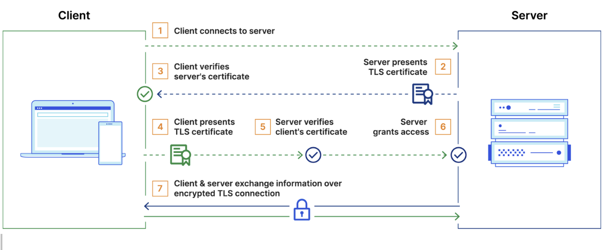

# mTLS Architecture and Implementation

This document outlines the implementation of Mutual TLS (mTLS) for secure communication between the attestor and db-service. mTLS is a method of mutual authentication which ensures that the parties at each end of a network connection are who they claim to be by verifying that they both have the correct private key.

In the `attestor` service, mTLS is implemented in the communication between between the `db-service` and the `chain service` inside the attestor. The db-service issues certificates for all attestors and the attestor implements these certificates for `GET` and `POST` requests on the db-service. The mTLS is implemented in Nginx where the db-service is proxied as a backend . The client validation is done by Nginx.

For implementation of mTLS, the attestor service should have the following files:
- Certificate Authority(CA) certificate
- Attestor Certificate
- Attestor private key

When the client(attestor) needs to communicate a message with the server(db-service), the mTLS handshake is triggered. In this process, the server presents its certificate to the client and client verifies the certificate. Once the server's certificate is verified, the client sends over its certificate to the server. After successful verification from the server, the mTLS handshake ends and data communication is initiated. The same process shown in the diagram below.



## Certificates and Key Generation 


Attestor clients can generate their own key and create a csr(certificate signing request) and send it to Venture23 team. The team will issue the certificate to them.

The general process of certificate generation is(using openssl tool):

1. Generate the CA certificate
```
openssl genpkey -algorithm RSA -out /etc/secret/mtls/ca.key
openssl req -new -x509 -key /etc/secret/mtls/ca.key -out /etc/secret/mtls/ca.cer
```

2. Generate a certificate and key for the Nginx server

```
openssl genpkey -algorithm RSA -out /etc/secret/mtls/server.key
openssl req -new -key /etc/secret/mtls/server.key -out /etc/secret/mtls/server.csr
openssl x509 -req -in /etc/secret/mtls/server.csr -CA /path/to/ca.crt -CAkey /etc/secret/mtls/ca.key -CAcreateserial -out /etc/secret/mtls/server.crt
```

3. Generate a client certificate and key for each client that will connect to the server.

```
openssl genpkey -algorithm RSA -out /etc/secret/mtls/attestor1.key
openssl req -new -key /etc/secret/mtls/attestor1.key -out /etc/secret/mtls/attestor1.csr
openssl x509 -req -in /etc/secret/mtls/attestor1.csr -CA /path/to/ca.crt -CAkey /etc/secret/mtls/ca.key -CAcreateserial -out /etc/secret/mtls/ca.cer
```